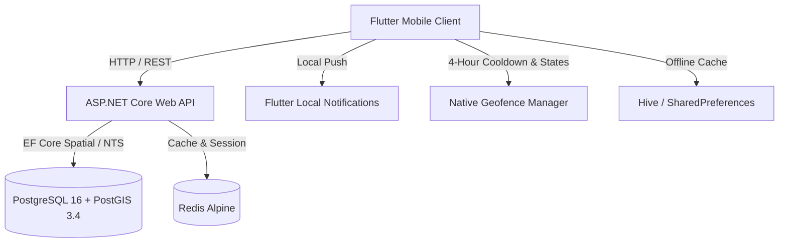

# Project "Spot" Architectural Specification

## 1. System Overview

Project **Spot** is a hyper-local, geofenced shopping and merchant media ecosystem built for battery efficiency, low-latency spatial discovery, and offline-first client resilience.



---

## 2. Spatial Engine & SRID 4326 Invariants

- **Coordinate System**: WGS 84 (`SRID: 4326`).
- **Coordinate Conventions**:
  - In NetTopologySuite (NTS): `Point(X, Y)` where `X = Longitude` and `Y = Latitude`.
  - In PostGIS: `ST_SetSRID(ST_MakePoint(longitude, latitude), 4326)`.
- **Indexing**: All geometry columns (`stores.location` and `task_lists.custom_location`) utilize **GIST** (Generalized Search Tree) spatial indexing:
  ```sql
  CREATE INDEX idx_stores_location ON stores USING GIST(location);
  CREATE INDEX idx_task_lists_custom_location ON task_lists USING GIST(custom_location);
  ```
- **Distance Calculation**:
  - Geodesic great-circle distance is calculated using the Haversine formula over the WGS 84 ellipsoidal model.
  - Queries apply a bounding-box pre-filter mapped to degrees of latitude and longitude (scaled by `cos(latitude)`) to leverage spatial indexes before calculating precise distance in meters.

---

## 3. Battery Efficiency & Geofence Mechanics

Mobile battery conservation is managed through three primary strategies:

1. **Adaptive Distance Filter**: The location listener requests updates using a 20-meter `distanceFilter` and `LocationAccuracy.balanced`, eliminating constant GPS receiver wakeups when stationary.
2. **State Transition Memory**: Geofence regions maintain three discrete states: `unknown`, `inside`, and `outside`. Triggers execute only during transitions (`outside` -> `inside` for `ENTER`; `inside` -> `outside` for `EXIT`).
3. **4-Hour Anti-Spam Cooldown Engine**:
   - Every geofence entity ID is tracked with its last-triggered timestamp.
   - When a user enters a geofence, the push notification engine checks `canTrigger(entityId)`.
   - If fewer than 4 hours (14,400 seconds) have elapsed since the last notification for that entity, the push notification is suppressed while maintaining active geofence state.

---

## 4. API Endpoints Specification

### Stores & Spatial Discovery
- `GET /api/v1/stores/nearby?latitude={lat}&longitude={lng}&radiusMeters={radius}&category={slug}`: Returns stores within proximity boundary, sorted by distance ascending.
- `GET /api/v1/stores/{id}`: Returns store details, category, and review summary.
- `GET /api/v1/stores`: Returns all stores.

### Task & Shopping Lists
- `GET /api/v1/tasklists?userId={userId}`: Retrieves all task lists for a user.
- `POST /api/v1/tasklists`: Creates a new geofenced task list with optional custom coordinates and radius.
- `GET /api/v1/tasklists/{id}`: Retrieves single list with checkable items.
- `PUT /api/v1/tasklists/{id}`: Updates title, location, or active state.
- `DELETE /api/v1/tasklists/{id}`: Deletes list and cascade deletes items.

### Task Items
- `POST /api/v1/tasklists/{listId}/items`: Adds an item with quantity.
- `PATCH /api/v1/tasklists/{listId}/items/{itemId}/toggle`: Toggles completion status.
- `DELETE /api/v1/tasklists/{listId}/items/{itemId}`: Deletes item.

### Store Reviews
- `GET /api/v1/stores/{storeId}/reviews`: Retrieves review summary (Average overall, service, and quality ratings).
- `POST /api/v1/stores/{storeId}/reviews`: Submits a customer review with 3 discrete 1-5 ratings.

### Real-Time Spatial SignalR Hub (`/hubs/location`)
- `SendLocation(double lat, double lng, double radiusMeters = 1500, string? category = null)`:
  - Caller receives `ReceiveNearbyStores(List<StoreDto>)` ordered by distance.
  - Caller receives `ReceiveGeofenceAlert(GeofenceAlertNotificationDto)` when entering immediate store radius.
- `JoinStoreZone(string storeId)`: Subscribes client connection to targeted store deal group.
- `LeaveStoreZone(string storeId)`: Unsubscribes client from store group.
- `BroadcastStoreDeal(string storeId, string title, string message)`: Broadcasts real-time deal alerts to users in the store zone.

