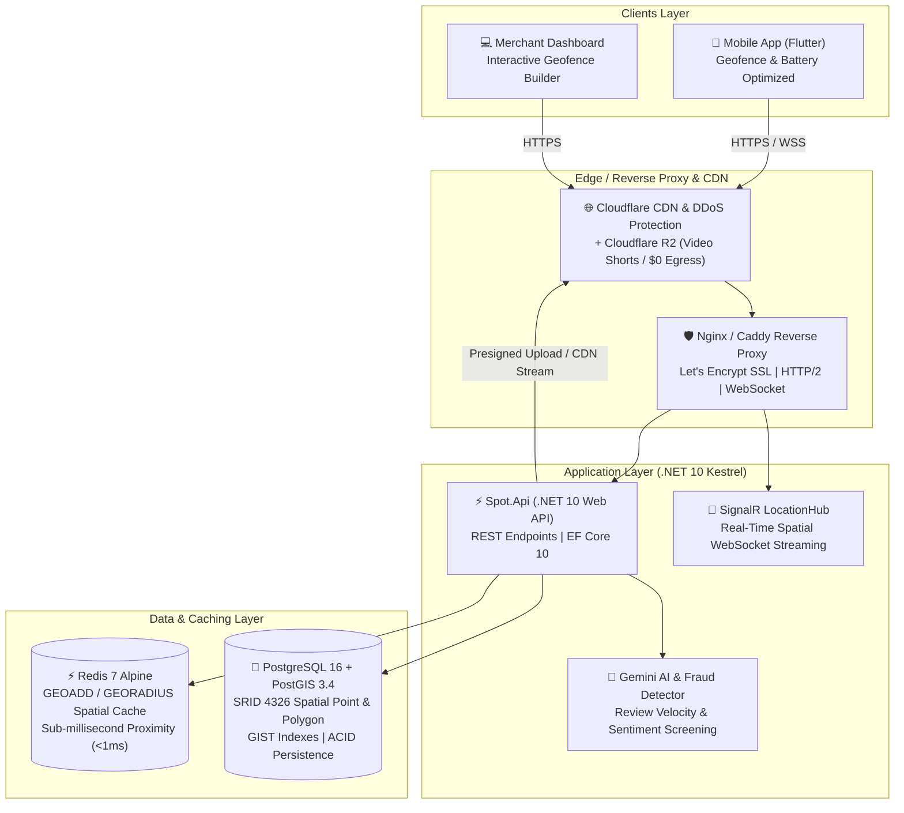

# Spot Ecosystem — Production Server & Infrastructure Architecture Guide

Այս փաստաթուղթը նախատեսված է **"Spot" Hyper-Local Geofenced Ecosystem**-ի ամբողջական պրոդակշն (Production) տեղակայման, սերվերային պահանջների հաշվարկի, ճարտարապետության և ծախսերի օպտիմալացման համար։

---

## 1. Ընդհանուր Տոպոլոգիա (Production Architecture)



---

## 2. Ի՞նչ Սերվերներ և Պարամետրեր են Անհրաժեշտ

### Հիմնական բաղադրիչների ռեսուրսների պահանջարկը (Resource Footprint)

| Բաղադրիչ | CPU | RAM | Պահեստ (Disk NVMe) | Ֆունկցիոնալություն |
| :--- | :--- | :--- | :--- | :--- |
| **PostgreSQL 16 + PostGIS 3.4** | 2 - 4 Core | 4 GB - 8 GB | 100 GB - 250 GB NVMe | Խանութների, առաջադրանքների, ռեվյուների և կոորդինատների (GIST ինդեքսներ) գլխավոր բազա |
| **Redis 7 (In-Memory GEO)** | 1 - 2 Core | 2 GB - 4 GB | 20 GB (AOF/RDB) | Խանութների կոորդինատների spatial caching, <1ms GEORADIUS որոնումներ, SignalR backplane |
| **.NET 10 Web API + SignalR** | 2 - 4 Core | 2 GB - 4 GB | 20 GB | REST API, WebSockets streaming, background geofence routing, Gemini AI review screening |
| **Nginx / Caddy (SSL + Proxy)** | 1 Core | 512 MB - 1 GB | 10 GB (Logs) | SSL/TLS տերմինացիա, WebSocket upgrade, Gzip/Brotli, DDoS throttling |
| **OS (Ubuntu 24.04 LTS) & Docker** | 1 Core | 1 GB - 2 GB | 20 GB | Համակարգային գործընթացներ, Docker daemon, մոնիտորինգ |

---

## 3. Սերվերների Ընտրանքներ (Cloud Provider Comparison)

### Տարբերակ 1. Մեկ Հզոր Dedicated / VPS Սերվեր (ԽՈՐՀՈՒՐԴ Է ՏՐՎՈՒՄ — Best Value)
Առաջին փուլի (MVP մինչև 50,000–100,000 ակտիվ օգտատեր) համար ամենաարդյունավետ, արագ և էժան լուծումը մեկ հզոր NVMe VPS կամ Dedicated սերվերն է, որտեղ բոլոր բաղադրիչները գործում են Docker Compose-ով (ներքին 10Gbps bridge ցանցում՝ զրոյական latency-ով)։

* **Hetzner Cloud (Գերմանիա կամ Ֆինլանդիա)**:
  * **Մոդել**: **CPX41** (8 vCPU AMD EPYC, 16 GB RAM, 240 GB NVMe SSD, 20 TB Traffic)
  * **Արժեք**: **~€23.80 / ամսական (~$26 / mo)**
  * *Կամ Dedicated Server*: **Hetzner AX42** (AMD Ryzen 7 8700G, 64 GB DDR5 ECC RAM, 2x 512 GB NVMe Software-RAID 1)
  * **Արժեք**: **~€46.00 / ամսական** (անսահմանափակ հզորություն մինչև 500k օգտատեր)

* **DigitalOcean (Ֆրանկֆուրտ / Ամստերդամ)**:
  * **Մոդել**: Premium AMD Droplet (4-8 vCPU, 16 GB RAM, 100-200 GB NVMe)
  * **Արժեք**: **~$84 – $96 / ամսական**

---

### Տարբերակ 2. Բաշխված Multi-Server Ճարտարապետություն (High Availability — 100k+ Users)
Երբ օգտատերերի բեռնվածությունը մեծանա, բաղադրիչները բաժանվում են առանձին սերվերների.

1. **Database Server (PostgreSQL + PostGIS)**: 4 vCPU, 16 GB RAM, NVMe RAID (Hetzner: ~€16/mo)
2. **Cache & Realtime Server (Redis 7)**: 2 vCPU, 8 GB RAM (Hetzner: ~€8/mo)
3. **App Cluster (2x .NET 10 API nodes behind Round-Robin)**: 2x 4 vCPU, 8 GB RAM (Hetzner: 2x ~€13 = ~€26/mo)
4. **Managed Media Storage**: Cloudflare R2 ($0 egress fees, ~$5–$15/mo)
* **Ընդհանուր ամսական ծախս**: **~$65 – $80 / ամսական**

---

### Տարբերակ 3. AWS / GCP Fully Managed (Enterprise)
* AWS RDS PostgreSQL (db.m6g.xlarge) + AWS ElastiCache Redis + AWS ECS Fargate + S3 + CloudFront
* **Արժեք**: **~$450 – $850 / ամսական** (նույն հզորության դեպքում 10-15 անգամ ավելի թանկ, քան Hetzner-ը)։

---

## 4. Մեդիայի և Վիդեոների Պահպանում (Video Shorts & Media)

Խանութների 24-ժամյա Shorts-երի և լուսանկարների համար **չի կարելի օգտագործել սովորական սերվերի սկավառակը** կամ սովորական AWS S3-ը (քանի որ վիդեոների դիտումների մեծ ծավալի դեպքում AWS-ի egress/traffic-ը շատ թանկ է)։

* **Լավագույն լուծում**: **Cloudflare R2**
  * **S3-Compatible API** (լիովին համատեղելի է մեր `IMediaStorageService`-ի և S3 SDK-ի հետ)։
  * **$0 Egress Fees** (վիդեոների բեռնումը օգտատերերի հեռախոսների մեջ լրիվ **անվճար է**, վճարում եք միայն պահպանվող գիգաբայթի համար՝ $0.015 / GB)։
  * Ավտոմատ կերպով միանում է Cloudflare Global CDN-ին՝ ապահովելով վիդեոների ակնթարթային բացումը Հայաստանում և ամբողջ աշխարհում։

---

## 5. PostgreSQL + PostGIS Պրոդակշն Օպտիմիզացիա (postgresql.conf)

16 GB RAM ունեցող սերվերի համար առաջարկվող կոնֆիգուրացիան (`/etc/postgresql/postgresql.conf` կամ Docker command args).

```ini
# Memory Configuration for 16GB Server
shared_buffers = 4GB                  # 25% of total RAM
effective_cache_size = 12GB           # 75% of total RAM
maintenance_work_mem = 1GB
work_mem = 64MB                       # Fast in-memory spatial sorting

# Checkpoints & WAL
min_wal_size = 1GB
max_wal_size = 4GB
checkpoint_completion_target = 0.9

# Query Planner Optimization for NVMe SSD
random_page_cost = 1.1                # Fast NVMe seek time
effective_io_concurrency = 200

# Worker Processes
max_worker_processes = 8
max_parallel_workers_per_gather = 4
max_parallel_workers = 8
```

---

## 6. Քայլ առ Քայլ Տեղակայման Ուղեցույց (Deployment Guide)

### Քայլ 1. Պատվիրել Սերվերը
1. Գրանցվել **Hetzner Cloud**-ում (կամ DigitalOcean-ում)։
2. Ստեղծել նոր սերվեր՝ **Ubuntu 24.04 LTS**, ընտրել **CPX41** (8 vCPU, 16GB RAM) կամ **CPX31** (4 vCPU, 8GB RAM)։
3. Տեղադրությունը՝ **Falkenstein (Գերմանիա)** կամ **Helsinki (Ֆինլանդիա)** (ցածր latency Հայաստանի համար՝ ~50-65ms)։
4. Ավելացնել Ձեր SSH Key-ը։

### Քայլ 2. Սերվերի Առաջնային Կարգավորում (Terminal)
Միանալ սերվերին SSH-ով և աշխատեցնել հետևյալ հրամանները.

```bash
# Համակարգի թարմացում
sudo apt update && sudo apt upgrade -y

# Անվտանգության Firewall (UFW)
sudo ufw default deny incoming
sudo ufw default allow outgoing
sudo ufw allow 22/tcp     # SSH
sudo ufw allow 80/tcp     # HTTP (Certbot & Redirect)
sudo ufw allow 443/tcp    # HTTPS & WebSockets
sudo ufw enable

# Docker և Docker Compose տեղադրում
curl -fsSL https://get.docker.com -o get-docker.sh
sudo sh get-docker.sh
sudo apt-get install -y docker-compose-plugin
```

### Քայլ 3. Կլոնավորել Ռեպոզիտորիան և Կոնֆիգուրացնել .env
```bash
git clone https://github.com/Vardan9191/spot-ecosystem.git
cd spot-ecosystem

# Պատճենել և լրացնել գաղտնաբառերը
cp docker/.env.example .env
nano .env
```

`.env` ֆայլի պարունակությունը.
```env
POSTGRES_DB=spot_db
POSTGRES_USER=spot_admin
POSTGRES_PASSWORD=SuperStrongProductionPassword2026!
REDIS_PASSWORD=StrongRedisAuthPassword2026!
GEMINI_API_KEY=AIzaSyYourProductionGeminiApiKey
S3_ACCESS_KEY=your_cloudflare_r2_access_key
S3_SECRET_KEY=your_cloudflare_r2_secret_key
S3_BUCKET=spot-media-production
```

### Քայլ 4. Գործարկել Ծառայությունները Docker Compose-ով
```bash
docker compose -f docker/docker-compose.prod.yml up -d --build
```

### Քայլ 5. Կարգավորել Դոմեյնը և SSL Վկայականը (Let's Encrypt)
Դոմեյնի DNS-ում (օրինակ՝ Cloudflare-ում) նշեք A Record-ը դեպի սերվերի IP հասցեն (օր. `api.spotapp.am`)։ Nginx-ը կամ Caddy-ն ավտոմատ կերպով կստանան անվճար SSL վկայական։

---

## 7. Պարբերական Պահուստավորում (Automated Backups)

Տվյալների անվտանգության համար սահմանվում է ամենօրյա գիշերային backup (cron job), որը PostgreSQL բազան կոմպրեսիա է անում և ուղարկում Cloudflare R2 / S3 պահոց.

```bash
# /etc/cron.daily/spot-db-backup
docker exec -t spot-postgres pg_dump -U spot_admin -Fc spot_db | gzip > /backups/spot_db_$(date +\%Y\%m\%d).dump.gz
```

---

## 8. Ամփոփ Ծախսերի Հաշվարկ (Monthly Budget)

| Ծառայություն | Տեսակ | Ամսական Ծախս |
| :--- | :--- | :--- |
| **Սերվեր (Hetzner CPX41)** | 8 vCPU, 16 GB RAM, 240 GB NVMe | **€23.80 (~$26)** |
| **Cloudflare R2 (Media Storage)** | 100 GB վիդեո / ֆոտո, $0 Egress | **~$1.50** |
| **Cloudflare DNS & DDoS** | Free Tier (Global CDN, SSL) | **$0.00** |
| **Google Gemini API** | Review Fraud Detection (Flash Tier) | **~$1.00 – $5.00** |
| **Դոմեյն (.am կամ .com)** | Տարեկան ~$10-$15 | **~$1.00** |
| **ԸՆԴԱՄԵՆԸ** | **Ամբողջական Production Համակարգ** | **~$30 – $35 / ամսական** |

*Եզրակացություն*: Ընդամենը **~$30-35 ամսական բյուջեով** մենք ստանում ենք գերարագ, մինչև 50,000–100,000 ակտիվ օգտատերերի սպասարկող, PostGIS spatial ինդեքսավորմամբ, Redis GEO քեշավորմամբ, SignalR իրական ժամանակի հոսքով և AI ֆիլտրացիայով հագեցած արդիական համակարգ։
